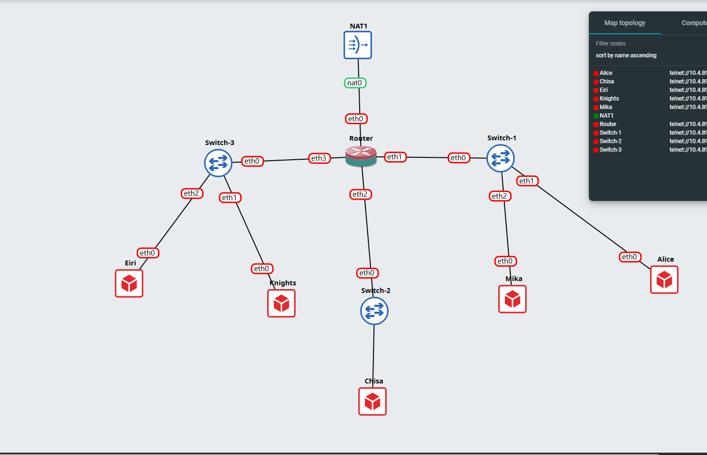
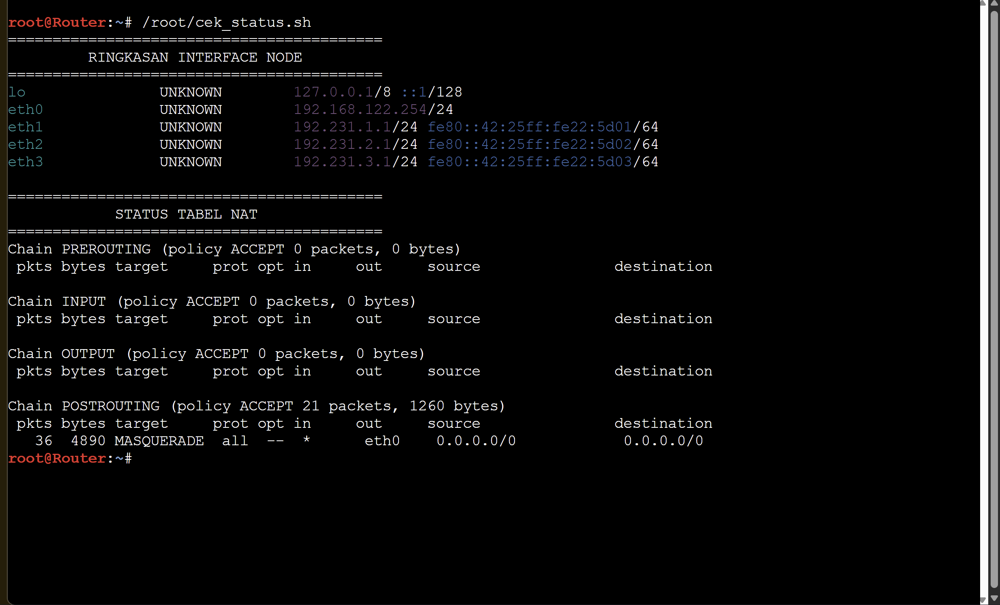
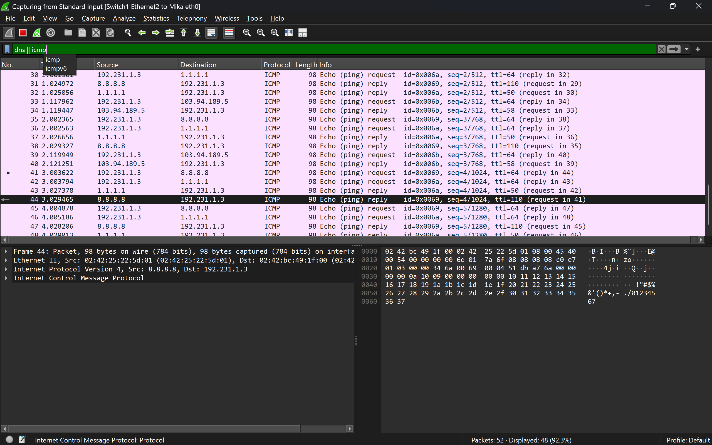

# Jarkom-Modul-1-2026-K-20

1. TOPLOPOGI
   

 konfigurasi
*route*
```
auto eth0
iface eth0 inet dhcp

auto eth1
iface eth1 inet static
    address 192.231.1.1
    netmask 255.255.255.0

auto eth2
iface eth2 inet static
    address 192.231.2.1
    netmask 255.255.255.0

auto eth3
iface eth3 inet static
    address 192.231.3.1
    netmask 255.255.255.0
```
*alice&mika*
```
auto eth0
iface eth0 inet static
    address 192.231.1.2
    netmask 255.255.255.0
    gateway 192.231.1.1
```
*chisa*
```
auto eth0
iface eth0 inet static
    address 192.231.2.2
    netmask 255.255.255.0
    gateway 192.231.2.1
```
*Knights&eiri*
```
auto eth0
iface eth0 inet static
    address 192.231.3.2
    netmask 255.255.255.0
    gateway 192.231.3.1
```
2. Menyambungkan ke Sinyal
   ktifkan fitur penerusan paket (IP forwarding) agar router diizinkan melewatkan paket data antar-jaringan:
 ```
   echo 1 > /proc/sys/net/ipv4/ip_forward
```
```
iptables -t nat -A POSTROUTING -o eth0 -j MASQUERADE
iptables -A FORWARD -i eth0 -o eth+ -m state --state RELATED,ESTABLISHED -j ACCEPT
iptables -A FORWARD -i eth+ -o eth0 -j ACCEPT
```
```
ip route add default via [IP_ROUTER_LAIN]
```
3&4. 
```
nameserver 8.8.8.8" > /etc/resolv.conf
```
dan ping client(192.231.x.x)
5.
buat skrip di lain  /root/cek_status.sh
```
cat << 'EOF' > /root/cek_status.sh
#!/bin/bash
echo "========================================="
echo "   RINGKASAN STATUS INTERFACE & NAT     "
echo "========================================="
echo ""
echo "[+] Status Interface Jaringan:"
ip -br a
echo ""
echo "[+] Status Tabel NAT (Iptables):"
iptables -t nat -L -v -n
echo "========================================="
EOF
```
kasih permission
```
chmod +x /root/cek_status.sh
```
jalankan
```
/root/cek_status.sh
```


6.
di console mika
```
wget [MASUKKAN_LINK_URL_FILE_DI_SINI] -O traffic_generator.sh
chmod +x traffic_generator.sh
./traffic_generator.sh
```
klik kanan pada yang ingin di capture lalu jalankan whiteshark saat itu klik filternya
```
dns || icmp
```

