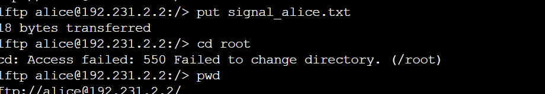
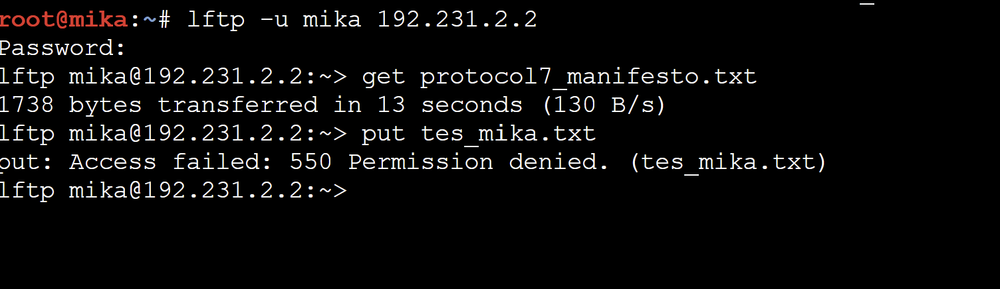

# Jarkom-Modul-1-2026-K-40

1. TOPLOPOGI
   

 konfigurasi
*route*
```
auto eth0
iface eth0 inet dhcp

auto eth1
iface eth1 inet static
    address 192.231.1.1
    netmask 255.255.255.0

auto eth2
iface eth2 inet static
    address 192.231.2.1
    netmask 255.255.255.0

auto eth3
iface eth3 inet static
    address 192.231.3.1
    netmask 255.255.255.0
```
*alice&mika*
```
auto eth0
iface eth0 inet static
    address 192.231.1.2
    netmask 255.255.255.0
    gateway 192.231.1.1
```
*chisa*
```
auto eth0
iface eth0 inet static
    address 192.231.2.2
    netmask 255.255.255.0
    gateway 192.231.2.1
```
*Knights&eiri*
```
auto eth0
iface eth0 inet static
    address 192.231.3.2
    netmask 255.255.255.0
    gateway 192.231.3.1
```
2. Menyambungkan ke Sinyal
   ktifkan fitur penerusan paket (IP forwarding) agar router diizinkan melewatkan paket data antar-jaringan:
 ```
   echo 1 > /proc/sys/net/ipv4/ip_forward
```
```
iptables -t nat -A POSTROUTING -o eth0 -j MASQUERADE
iptables -A FORWARD -i eth0 -o eth+ -m state --state RELATED,ESTABLISHED -j ACCEPT
iptables -A FORWARD -i eth+ -o eth0 -j ACCEPT
```
```
ip route add default via [IP_ROUTER_LAIN]
```
3&4. 
```
nameserver 8.8.8.8" > /etc/resolv.conf
```
dan ping client(192.231.x.x)
5.
buat skrip di lain  /root/cek_status.sh
```
cat << 'EOF' > /root/cek_status.sh
#!/bin/bash
echo "========================================="
echo "   RINGKASAN STATUS INTERFACE & NAT     "
echo "========================================="
echo ""
echo "[+] Status Interface Jaringan:"
ip -br a
echo ""
echo "[+] Status Tabel NAT (Iptables):"
iptables -t nat -L -v -n
echo "========================================="
EOF
```
kasih permission
```
chmod +x /root/cek_status.sh
```
jalankan
```
/root/cek_status.sh
```


6.
di console mika
```
wget [MASUKKAN_LINK_URL_FILE_DI_SINI] -O traffic_generator.sh
chmod +x traffic_generator.sh
./traffic_generator.sh
```
klik kanan pada yang ingin di capture lalu jalankan whiteshark saat itu klik filternya
```
dns || icmp
```


7.

Di **Console Chisa**:
```bash
apt update && apt install vsftpd -y
useradd -m alice && echo "alice:123" | chpasswd
useradd -m mika && echo "mika:123" | chpasswd
useradd -m eiri && echo "eiri:123" | chpasswd
```


```bash
mkdir -p /var/wired/data
chown -R ftp:ftp /var/wired/data
chmod 755 /var/wired/data
```


```bash
nano /etc/vsftpd.conf
```

```
listen=YES
anonymous_enable=NO
local_enable=YES
write_enable=YES
local_umask=022
dirmessage_enable=YES
use_localtime=YES
xferlog_enable=YES
connect_from_port_20=YES
chroot_local_user=YES
secure_chroot_dir=/var/run/vsftpd/empty
pam_service_name=vsftpd
local_root=/var/wired/data
pasv_enable=YES
pasv_min_port=40000
pasv_max_port=50000
user_config_dir=/etc/vsftpd_user_conf
userlist_enable=YES
userlist_file=/etc/vsftpd.user_list
userlist_deny=YES
```


```bash
mkdir -p /etc/vsftpd_user_conf

# Alice -> Read & Write
echo "write_enable=YES" > /etc/vsftpd_user_conf/alice

# Mika -> Read-only
echo "write_enable=NO" > /etc/vsftpd_user_conf/mika

# Eiri -> Blacklist (tidak boleh login sama sekali)
echo "eiri" >> /etc/vsftpd.user_list
```

### 7.5 Jalankan ulang service vsftpd

```bash
/etc/init.d/vsftpd restart
```

**Verifikasi service aktif:**
```bash
ss -tuln | grep :21
```
Port 21 harus berstatus `LISTEN`.

### Pembuktian: Alice bisa upload (`signal_alice.txt`)

Di **Console Alice**, buat file yang akan diupload:
```bash
echo "Ini pesan dari Alice" > signal_alice.txt
```

Login FTP ke Chisa lalu upload:
```bash
ftp 192.231.2.2
# user: alice
# password: 123
put signal_alice.txt
exit
```

Di **Console Eiri**, coba login FTP:
```bash
ftp 192.231.2.2
# user: eiri
# password: 123
```
Hasil yang diharapkan: koneksi langsung ditolak dengan pesan `530 Permission denied` / login failed — bukti bahwa Eiri sudah masuk `userlist_deny` dan tidak bisa mengakses FTP sama sekali.



8.

Di **Console Knights**:
```bash
cat << 'EOF' > knights_report.txt
==================================================
  KNIGHTS OF THE EASTERN CALCULUS — STATUS REPORT
  Protocol 7 Surveillance Network
  Classification: LEVEL 7 — EYES ONLY
==================================================

Date: [CLASSIFIED]
Agent: Knights Unit Alpha
Node: Switch 3 — Subnet 192.231.3.0/24

---
SUBJECT: Network Reconnaissance Report
The Wired has been successfully infiltrated through Protocol 7 channels.
--- END OF REPORT ---
EOF
```

### Mulai capture Wireshark

Di **GNS3**, klik kanan kabel yang terhubung ke node Knights (atau Chisa) → **Start capture**. Biarkan merekam sebelum upload dilakukan.

### Login FTP dari Knights memakai akun `alice`

```bash
lftp -u alice 192.231.2.2
# password: 123
put knights_report.txt
exit
```

Di **Console Mika**, buat file dummy untuk memancing error:
```bash
echo "Ini file percobaan upload dari Mika" > file_mika.txt
```

Login dan uji hak akses:
```bash
lftp -u mika 192.231.2.2
# password: 123
get protocol7_manifesto.txt   # berhasil -> bukti hak READ
put file_mika.txt             # ditolak  -> bukti TIDAK ADA hak WRITE
exit
```



9.


